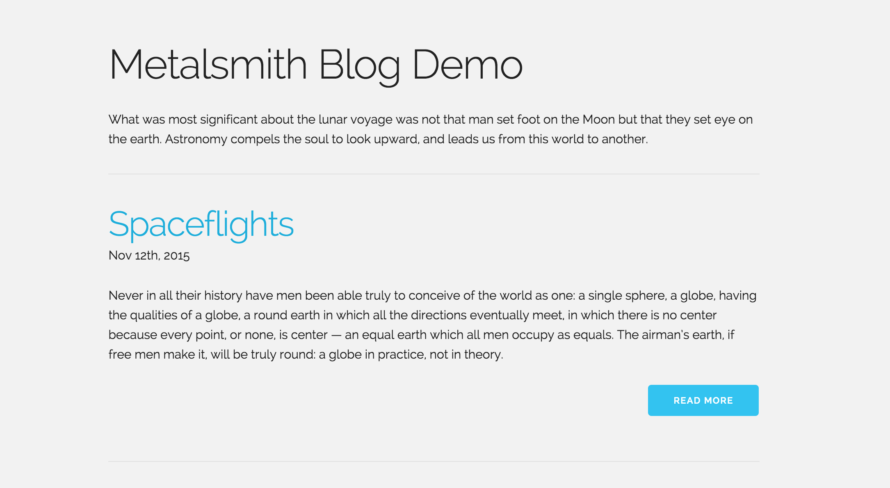

# Metalsmith Blog Demo

Demonstration of creating a blog using [Metalsmith](http://www.metalsmith.io/).




## Install

Install metalsmith and dependencies.

```
$ npm install
```

## Build and Serve

Output is saved into `/dist` folder, and is accessible at `localhost:3000`

```
$ npm start
```

### License

MIT
